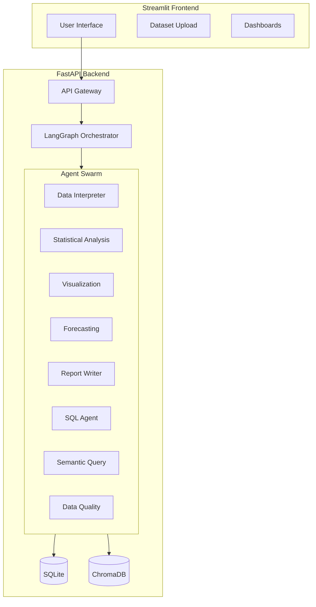
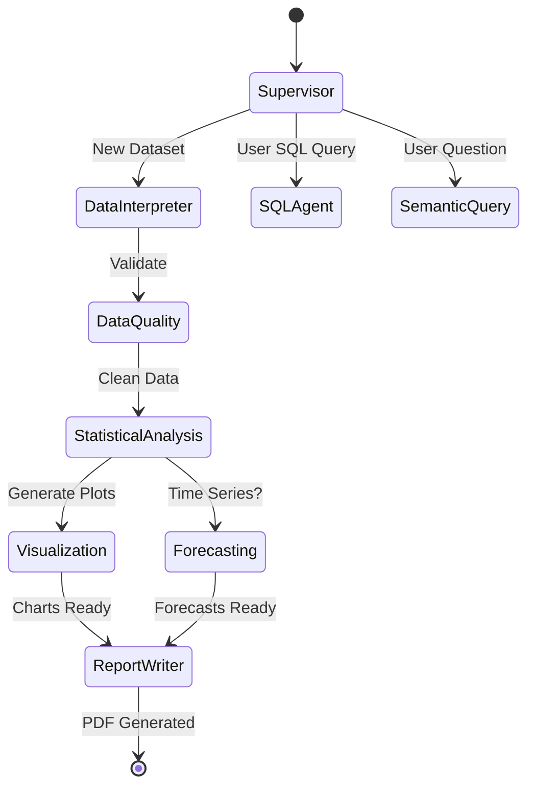
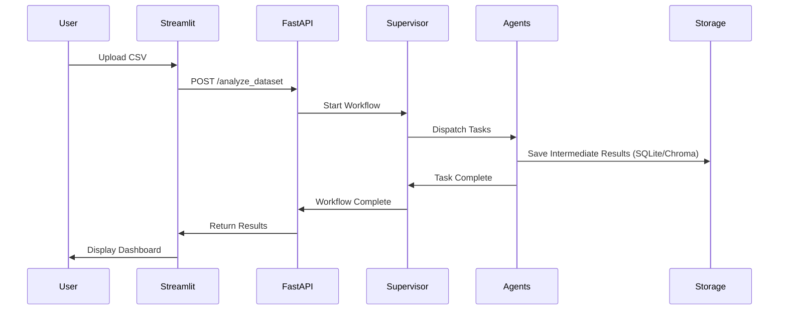
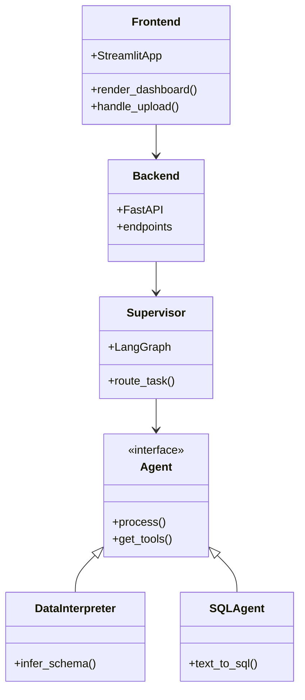

# AI Business Intelligence Copilot

A fully production-ready AI Business Intelligence Copilot, using free and open-source tools, with multi-agent reasoning, semantic querying, SQL generation, data analysis, forecasting, charts, PDF reports, evaluation, observability, and full-stack deployment.

## 📂 Folder Structure

```
ai-bi-copilot/
│── backend/
│   ├── main.py
│   ├── agents/
│   │   ├── data_interpreter.py
│   │   ├── statistical_agent.py
│   │   ├── visualization_agent.py
│   │   ├── forecasting_agent.py
│   │   ├── report_writer.py
│   │   ├── sql_agent.py
│   │   ├── semantic_query_agent.py
│   │   └── data_quality_agent.py
│   ├── graph/
│   │   └── workflow.py
│   ├── analysis/
│   ├── visualizations/
│   ├── forecasting/
│   ├── report/
│   ├── sql/
│   ├── semantic_query/
│   ├── data_quality/
│   └── utils/
│
│── frontend/
│   └── app.py
│
│── tests/
│── docker/
│── requirements.txt
│── README.md
│── docker-compose.yml
```

## 🏗 Architecture Diagrams

### 1. System Architecture



### 2. Multi-Agent Workflow



### 3. Data Flow



### 4. Component Diagram



## 🚀 Deployment

### Prerequisites
- Docker & Docker Compose
- API Keys (Groq, OpenRouter, HuggingFace)

### Running Locally
1. Clone the repository
2. Create a `.env` file with your API keys
3. Run `docker-compose up --build`
4. Access Frontend at `http://localhost:8501`
5. Access Backend Docs at `http://localhost:8000/docs`
